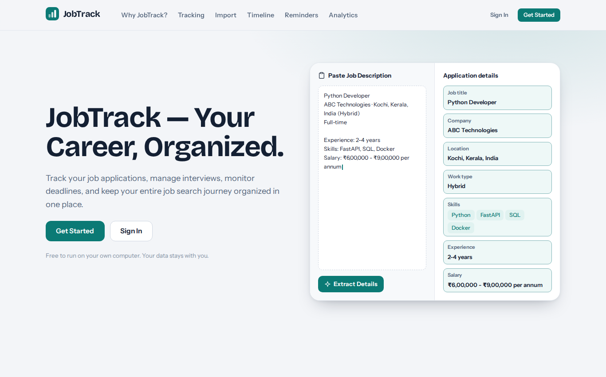
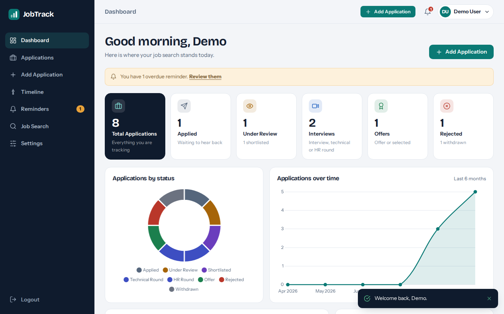
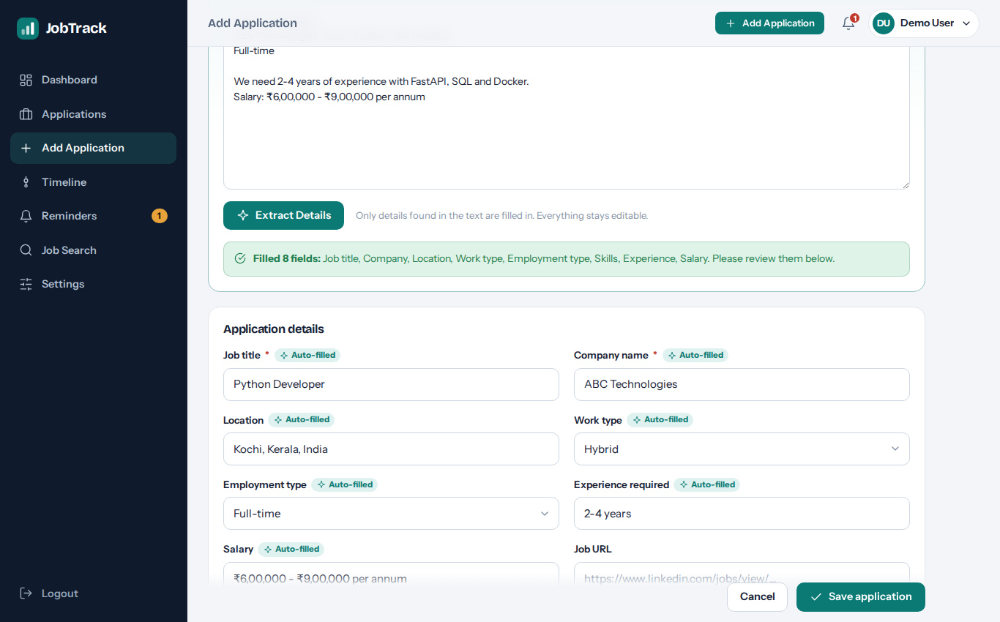
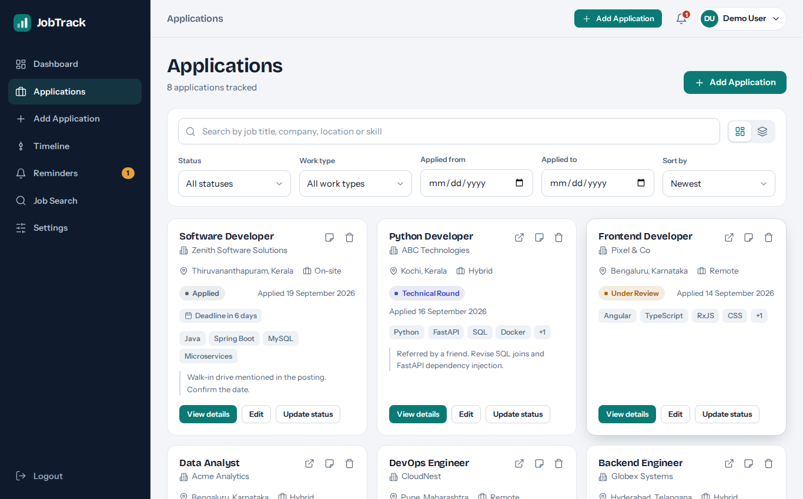
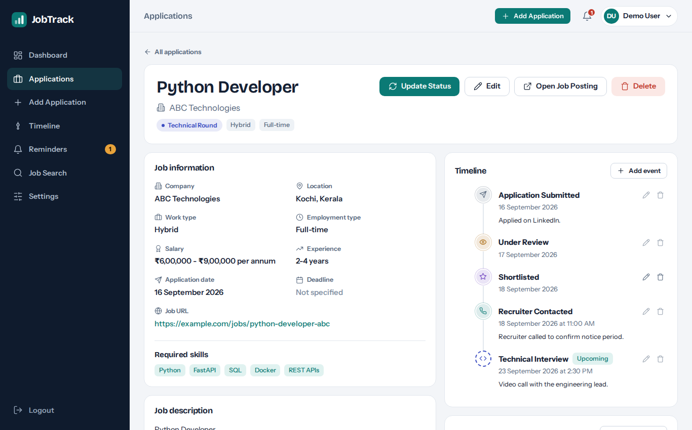

# JobTrack — Your Career, Organized.

JobTrack is a full-stack **job application tracker**. You find a job on LinkedIn, Indeed or a company site, apply there, then paste the job description into JobTrack. It fills in the application form for you, and from then on you track the status, timeline, interviews, deadlines and reminders in one place.

> JobTrack is a tracker, not a scraper. It never crawls job sites.



## Features

- **Paste a job description, click ✨ Extract Details.** Title, company, location, work type, employment type, skills, experience and salary are detected and the form is filled in. Anything that cannot be found is left blank, and every field stays editable. Works fully offline; an AI API is optional.
- **Job cards** with view, edit, delete, quick status update, notes and a link to the original posting. Card view and responsive table view.
- **Status tracking** with ten statuses (Applied, Under Review, Shortlisted, Interview, Technical Round, HR Round, Offer, Selected, Rejected, Withdrawn).
- **Timeline per application.** Every status change adds an event automatically. Add, edit and delete your own events with date, time and notes. A combined Timeline page covers all applications.
- **Reminders** for follow-ups, interviews, deadlines, recruiter replies and custom tasks: add, edit, delete, mark completed. Overdue and due-soon reminders show in the notification bell.
- **Search, filter and sort** by title, company, location and skills; status, work type and application date; newest, oldest, deadline, company and job title.
- **Dashboard analytics** computed from your data: summary cards, applications by status, applications over time, progress funnel, interviews per month, upcoming interviews, deadlines and reminders, recent applications and activity.
- **Authentication**: registration, sign in, JWT sessions, bcrypt password hashing, protected routes, change password, and a password-reset flow (see notes below).
- **Job Search page** that opens searches on LinkedIn, Indeed, Glassdoor and Google Jobs in a new tab. Planned integrations are clearly marked as not available yet.
- **Settings**: profile, password, light/dark/system theme, logout.
- Animated landing and sign-in pages, responsive layout from phone to desktop, dark mode, empty, loading and error states, friendly error messages.

| | |
|---|---|
|  |  |
|  |  |

## Technology stack

| Layer | Technology |
|---|---|
| Frontend | Angular 21 (standalone components, signals), TypeScript, Angular Router, Reactive Forms, HttpClient, Chart.js |
| Backend | Python, FastAPI, SQLAlchemy 2, Pydantic 2 |
| Database | SQLite |
| Auth | JWT (PyJWT), bcrypt |

## Folder structure

```
JobTrack/
├── backend/
│   ├── app/
│   │   ├── main.py              FastAPI app, CORS, routers
│   │   ├── config.py            Settings from environment variables
│   │   ├── seed.py              Demo data (python -m app.seed)
│   │   ├── auth/                Password hashing, JWT, current-user dependency
│   │   ├── database/            Engine, session, table creation
│   │   ├── models/              SQLAlchemy models and enums
│   │   ├── schemas/             Pydantic request/response schemas
│   │   ├── routers/             auth, applications, timeline, reminders, dashboard
│   │   ├── services/            application, dashboard and extraction logic
│   │   │   └── extraction/      local extractor, optional AI extractor
│   │   └── utils/               error handling, time helpers
│   ├── tests/                   pytest suite (22 tests)
│   └── requirements.txt
├── frontend/
│   └── src/app/
│       ├── core/                services, models, guard, interceptor, app shell
│       ├── shared/              icons, modal, chart, dialogs, cards, pipes
│       └── features/
│           ├── landing/  auth/  dashboard/  applications/
│           └── timeline/  reminders/  job-search/  settings/
├── docs/screenshots/
├── .env.example
├── .gitignore
└── README.md
```

## Requirements

- **Python 3.10+**
- **Node.js 20.19+ or 22.12+** (required by Angular 21) and npm

## Installation and setup

### 1. Environment variables

```bash
cp .env.example .env
```

Generate a secret and paste it after `JWT_SECRET=` in `.env`:

```bash
python -c "import secrets; print(secrets.token_urlsafe(48))"
```

If `JWT_SECRET` is empty, the backend still starts with a temporary secret, but everyone is signed out on every restart.

### 2. Backend

```bash
cd backend
python -m venv venv

# macOS / Linux
source venv/bin/activate
# Windows (PowerShell)
venv\Scripts\Activate.ps1

pip install -r requirements.txt
python -m app.database.init_db        # creates backend/jobtrack.db
uvicorn app.main:app --reload --port 8000
```

The API is now at <http://localhost:8000> and the interactive docs are at <http://localhost:8000/docs>. Tables are also created automatically on startup, so `init_db` is optional.

### 3. Frontend

Open a second terminal:

```bash
cd frontend
npm install
npm start
```

Open <http://localhost:4200>. The frontend expects the API at `http://localhost:8000`; change `frontend/src/environments/environment.ts` if yours is elsewhere (and add the new origin to `CORS_ORIGINS`).

### 4. Demo data (optional)

```bash
cd backend
python -m app.seed            # creates the demo account with 8 sample applications
python -m app.seed --reset    # deletes and recreates it
```

Sign in with **demo@jobtrack.dev** / **Demo@1234**. Demo data lives in its own flagged account and never mixes with real users. Deleting that one account removes it all.

## How to use it

1. Open <http://localhost:4200>, choose **Get Started**, and create an account (or use the demo account).
2. Click **Add Application**, paste a job description, and click **✨ Extract Details**.
3. Review the filled-in fields, edit anything, and click **Save application**. The job card appears on your Applications page and Dashboard.
4. Use **Update Status** on a card, or open **View details**, to move it forward. Each change appears in its timeline.
5. On the details page, **Add event** and **Add reminder** for interviews and follow-ups.
6. Watch the Dashboard update.

## Environment variables

| Variable | Purpose | Default |
|---|---|---|
| `DATABASE_URL` | SQLAlchemy URL | `sqlite:///backend/jobtrack.db` |
| `JWT_SECRET` | Signing key for tokens (32+ chars) | temporary random key |
| `JWT_ALGORITHM` | Token algorithm | `HS256` |
| `ACCESS_TOKEN_EXPIRE_MINUTES` | Token lifetime | `1440` |
| `CORS_ORIGINS` | Allowed frontend origins, comma-separated | `http://localhost:4200,http://127.0.0.1:4200` |
| `FRONTEND_URL` | Used in password-reset links | `http://localhost:4200` |
| `OPTIONAL_AI_API_KEY` | Enables AI-assisted extraction | empty (off) |
| `AI_PROVIDER` | `anthropic` or `openai` (OpenAI-compatible) | `anthropic` |
| `AI_MODEL` | Model name; empty uses the provider default | empty |
| `AI_BASE_URL` | Custom API base URL | empty |

### How extraction works

1. The **local extractor** (always on) uses rules and a skill catalogue: labelled lines (`Location:`), the LinkedIn/Indeed header layout, work-type and employment-type keywords, experience and salary patterns.
2. If `OPTIONAL_AI_API_KEY` is set, the AI result is used first and the local result fills any gaps. Each value the model returns is checked against the pasted text and dropped if it does not appear there, so the model cannot add details that are not in the posting. If the AI call fails, the local result is used.

## API overview

All routes except register, login and password reset need `Authorization: Bearer <token>`. Full interactive docs are at `/docs`.

| Method | Path | Description |
|---|---|---|
| POST | `/auth/register` | Create an account, returns a token |
| POST | `/auth/login` | Sign in, returns a token |
| GET / PUT | `/auth/me` | Current user / update profile |
| POST | `/auth/change-password` | Change password |
| POST | `/auth/forgot-password`, `/auth/reset-password` | Password reset |
| GET / POST | `/applications` | List (search, status, work_type, date_from, date_to, sort) / create |
| POST | `/applications/extract` | Extract details from pasted text |
| GET / PUT / DELETE | `/applications/{id}` | Read / update / delete |
| PATCH | `/applications/{id}/status` | Change status (adds a timeline event) |
| GET / POST | `/applications/{id}/timeline` | Application timeline |
| GET | `/timeline` | Events across all applications |
| PUT / DELETE | `/timeline/{id}` | Edit / delete an event |
| GET / POST | `/reminders` | List (`completed`, `application_id`) / create |
| PUT / DELETE | `/reminders/{id}` | Edit or complete / delete |
| GET | `/dashboard/stats` | Dashboard data |

`GET /applications`, `/reminders`, `/timeline` and every `{id}` route only return the signed-in user's own data. Someone else's id returns 404.

## Notes

- **Password reset** has no email service because JobTrack runs locally. "Forgot Password?" prints a 30-minute reset link in the backend terminal. Open it in your browser to choose a new password. Plug a mail provider into `routers/auth.py` if you deploy it.
- **Employment type** is stored as an extra column on applications because the extractor detects it.
- The database tables are created with `create_all`. There is no migration tool yet; if you change models, delete `backend/jobtrack.db` (or add Alembic).

## Tests

```bash
cd backend
pytest
```

The suite covers registration, login, protected routes, user isolation, application CRUD, status-driven timeline events, search, filters and sorting, extraction (including the AI grounding check), reminders, dashboard statistics and the demo seed.

## Push to GitHub

```bash
cd JobTrack
git init
git add .
git commit -m "Initial commit: JobTrack"
git branch -M main
git remote add origin https://github.com/<your-username>/JobTrack.git
git push -u origin main
```

`.gitignore` already excludes `node_modules`, `dist`, `.env`, virtual environments, `__pycache__` and SQLite files. Commit `.env.example`, never `.env`.

## Future improvements

- Email delivery for password reset and reminder emails
- Official job-board API integrations on the Job Search page
- Import from application confirmation emails
- Drag-and-drop kanban board by status
- Export applications to CSV
- Alembic migrations, login rate limiting, refresh tokens
- Frontend unit and end-to-end tests
